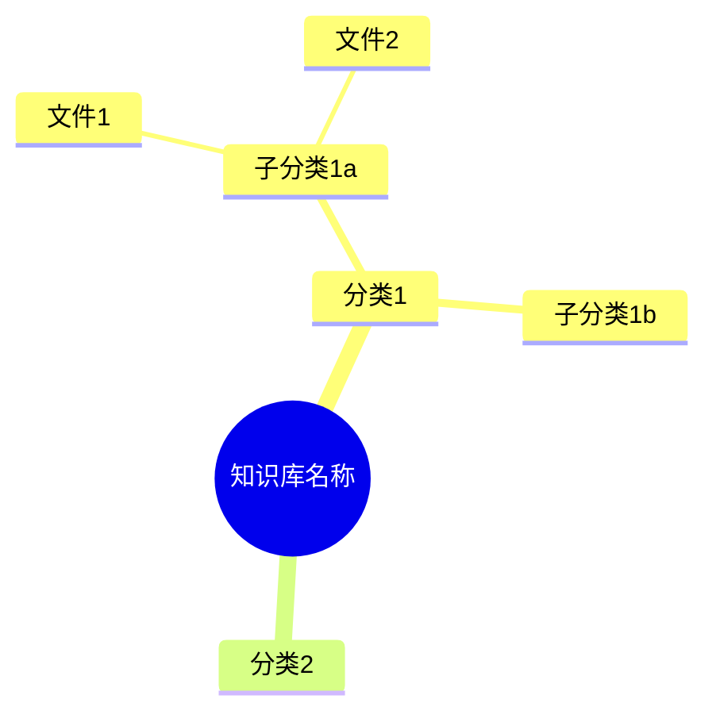

# 知识库索引模板

当用户请求查看知识库全景或数据更新后需要同步思维导图时，同时更新以下两个文件：
- `D:\知识库创建\00_知识库索引.mermaid` — Mermaid语法版
- `D:\知识库创建\知识库全景思维导图.html` — 可视化HTML版（内容与mermaid同步）

## 更新前确认

每次更新前必须先问用户："思维导图是需要**重新扫描全目录**还是**基于当前内容直接叠加**？"
- **重新扫描**：遍历D盘所有目录和文件，全量重建（适合月度知识体检或大整理后）
- **直接叠加**：只把本次变更的部分更新到现有思维导图中（默认方式，适合周度更新，效率更高）

## 生成规则

1. 遍历 `D:\知识库创建\` 下所有目录和文件
2. 按编号体系组织节点
3. 标注文件数量和关键内容
4. 对缺失/待补充的部分用特殊标记（⚠）
5. 对新增/重点内容用特殊标记（★）
6. 标注更新周次（如"★W17更新"）

## 06_客户追踪展开要求

思维导图的06_客户追踪部分必须展开到以下维度：
- **客户档案**：按客户列出核心项目、关键人、风险等级
- **周报**：Excel 5Sheet格式说明
- **活跃Pipeline**：跨客户的重点项目机会（量级+紧急度）
- **竞品渗透**：当前各客户的竞品威胁等级和应对策略

## Mermaid语法规范

## HTML同步规范

更新mermaid后，必须同步更新 `D:\知识库创建\知识库全景思维导图.html`，保持两者内容一致。

## 更新频率

- **周度**：每次周报/客户档案更新后叠加更新
- **月度**：知识体检时全量重新扫描
- **即时**：用户主动要求时
