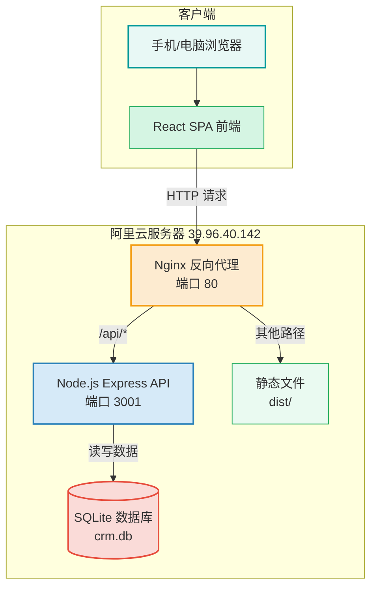
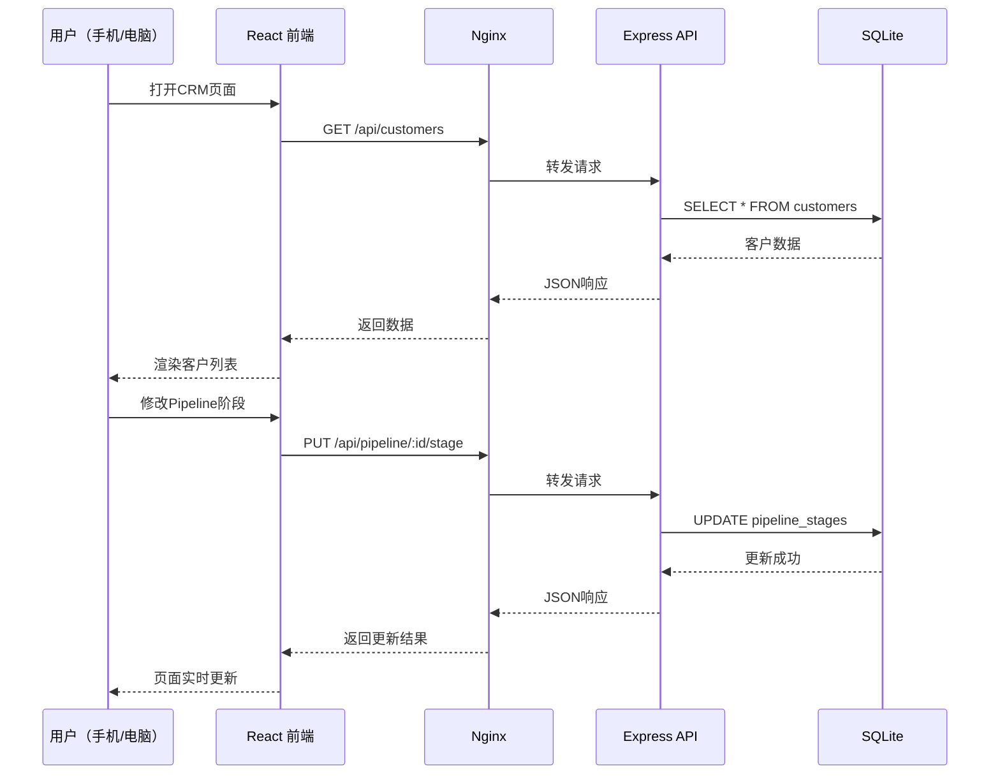
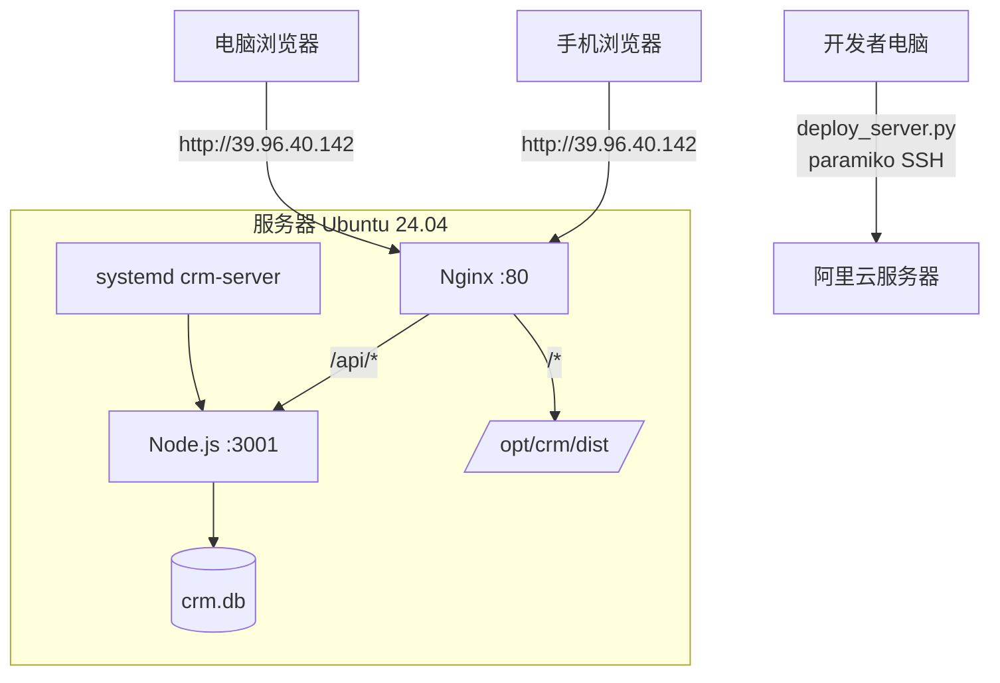
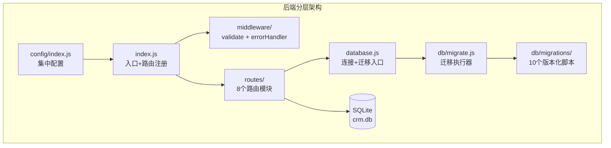

# CRM 系统架构文档

> 版本: V26.06.09 | 更新日期: 2026-06-16
> 西门子OEM南京区域 · 个人销售CRM系统

---

## 1. 系统架构总览



**架构说明：**
- **前端**：React 18 + TypeScript + TailwindCSS v4 构建的SPA应用
- **Nginx**：负责静态文件服务和API请求的反向代理转发
- **Express API**：Node.js后端，提供RESTful接口
- **SQLite**：轻量级嵌入式数据库，better-sqlite3同步驱动

---

## 2. 数据流图



---

## 3. 模块关系图

```mermaid
graph LR
    subgraph 前端页面模块
        P1[仪表盘]
        P2[客户管理]
        P3[商机管道]
        P4[竞品分析]
        P5[精力分配]
        P6[AI教练]
        P7[周报]
    end
    
    subgraph API层
        A1[/api/customers]
        A2[/api/pipeline]
        A3[/api/todos]
        A4[/api/notes]
        A5[/api/invest-items]
        A6[/api/weekly]
        A7[/api/memories]
        A8[/api/imports]
        A9[/api/customers/:id/context]
    end
    
    subgraph 数据库表
        T1[(customers)]
        T2[(pipeline_stages)]
        T3[(todos)]
        T4[(notes)]
        T5[(contacts)]
        T6[(invest_items)]
        T7[(weekly_reports)]
        T8[(weekly_focuses)]
        T9[(weekly_actions)]
        T10[(weekly_daily_notes)]
        T11[(ai_memories)]
        T12[(ai_source_files)]
        T13[(ai_import_jobs)]
        T14[(ai_memory_links)]
    end
    
    P1 --> A1
    P1 --> A3
    P2 --> A1
    P2 --> A9
    P3 --> A2
    P4 --> A1
    P6 --> A5
    P6 --> A7
    P7 --> A6
    
    A1 --> T1
    A1 --> T5
    A2 --> T2
    A3 --> T3
    A4 --> T4
    A5 --> T6
    A6 --> T7
    A6 --> T8
    A6 --> T9
    A6 --> T10
    A7 --> T11
    A8 --> T12
    A8 --> T13
    A9 --> T11
    A9 --> T1
```

---

## 4. API接口清单

### 4.1 客户管理 `/api/customers`

| 方法 | 路径 | 说明 | 请求参数 | 响应 |
|------|------|------|----------|------|
| GET | `/api/customers` | 获取客户列表 | `?search=&sort=priority` | `{ data: Customer[] }` |
| GET | `/api/customers/:id` | 获取客户详情 | URL参数 id | `{ data: Customer }` |
| POST | `/api/customers` | 新增客户 | Body: CustomerForm | `{ data: Customer }` |
| PUT | `/api/customers/:id` | 修改客户 | Body: CustomerForm | `{ data: Customer }` |
| DELETE | `/api/customers/:id` | 删除客户 | URL参数 id | `{ success: true }` |
| POST | `/api/customers/:id/contacts` | 新增联系人 | Body: `{ name, role?, phone?, email?, stars?, tag? }` | `{ data: KeyPerson }` |
| PUT | `/api/customers/:id/contacts/:contactId` | 修改联系人 | Body: `{ name?, role?, phone?, email?, stars?, tag? }` | `{ data: KeyPerson }` |
| DELETE | `/api/customers/:id/contacts/:contactId` | 删除联系人 | URL参数 contactId | `{ success: true }` |

### 4.2 商机管道 `/api/pipeline`

| 方法 | 路径 | 说明 | 请求参数 | 响应 |
|------|------|------|----------|------|
| GET | `/api/pipeline` | Pipeline汇总统计 | `?includeLost=true` | `{ data: StageSummary[] }` |
| GET | `/api/pipeline/lost` | 已丢失商机列表 | 无 | `{ data: PipelineItem[] }` |
| GET | `/api/pipeline/won` | 已赢得商机列表 | 无 | `{ data: PipelineItem[] }` |
| GET | `/api/pipeline/:customerId` | 客户商机列表 | URL参数 customerId | `{ data: PipelineItem[] }` |
| POST | `/api/pipeline` | 新增商机 | Body: `{ customerId, name, stage?, amount?, pipeStage?, expectedCloseDate?, statusDescription? }` | `{ data: PipelineItem }` |
| PUT | `/api/pipeline/:id` | 更新商机字段 | Body: `{ name?, stage?, amount?, pipeStage?, note?, expectedCloseDate?, statusDescription?, lostReason? }` | `{ data: PipelineItem }` |
| PUT | `/api/pipeline/:id/stage` | 切换阶段 | Body: `{ stage: number }` | `{ data: PipelineItem }` |
| PUT | `/api/pipeline/:id/lost` | 标记丢失 | Body: `{ reason? }` | `{ data: PipelineItem }` |
| PUT | `/api/pipeline/:id/win` | 标记赢得 | 无 | `{ data: PipelineItem }` |
| PUT | `/api/pipeline/:id/restore` | 恢复丢失/赢得商机 | 无 | `{ data: PipelineItem }` |
| DELETE | `/api/pipeline/:id` | 永久删除商机 | URL参数 id | `{ success: true }` |

### 4.3 待办事项 `/api/todos`

| 方法 | 路径 | 说明 | 请求参数 | 响应 |
|------|------|------|----------|------|
| GET | `/api/todos` | 获取待办列表 | `?status=pending\|completed\|all` | `{ data: Todo[] }` |
| POST | `/api/todos` | 新增待办 | Body: `{ text, customerId?, deadline? }` | `{ data: Todo }` |
| PUT | `/api/todos/:id` | 更新待办 | Body: `{ completed?, text?, deadline?, customerId? }` | `{ data: Todo }` |
| DELETE | `/api/todos/:id` | 删除待办 | URL参数 id | `{ success: true }` |

### 4.4 速记笔记 `/api/notes`

| 方法 | 路径 | 说明 | 请求参数 | 响应 |
|------|------|------|----------|------|
| GET | `/api/notes` | 获取笔记列表(含customerName) | `?customerId=` | `{ data: Note[] }` |
| POST | `/api/notes` | 新增笔记 | Body: `{ customerId, content }` | `{ data: Note }` |
| DELETE | `/api/notes/:id` | 删除笔记 | URL参数 id | `{ success: true }` |

### 4.5 投资评分项 `/api/invest-items`

| 方法 | 路径 | 说明 | 请求参数 | 响应 |
|------|------|------|----------|------|
| GET | `/api/invest-items` | 获取评分项列表(含customerName) | 无 | `{ data: InvestItem[] }` |
| POST | `/api/invest-items` | 新增评分项 | Body: `{ name, key?, customerId? }` | `{ data: InvestItem }` |
| PUT | `/api/invest-items/:key` | 更新评分项 | Body: `{ name?, customerId? }` | `{ data: InvestItem }` |
| DELETE | `/api/invest-items/:key` | 删除评分项 | URL参数 key | `{ success: true }` |

### 4.6 周报管理 `/api/weekly`

| 方法 | 路径 | 说明 | 请求参数 | 响应 |
|------|------|------|----------|------|
| GET | `/api/weekly` | 获取所有周报 | 无 | `{ data: WeeklyReport[] }` |
| POST | `/api/weekly` | 新建周报 | Body: `{ weekId, label? }` | `{ data: WeeklyReport }` |
| PUT | `/api/weekly/:weekId/focuses` | 更新重点 | Body: `{ focuses: string[] }` | `{ data: WeeklyFocus[] }` |
| PUT | `/api/weekly/:weekId/daily-notes` | 更新每日记录 | Body: `{ dayKey, content }` | `{ data: WeeklyDailyNote }` |
| POST | `/api/weekly/:weekId/actions` | 新增行动项 | Body: `{ text }` | `{ data: WeeklyAction }` |
| PUT | `/api/weekly/:weekId/actions/:id` | 更新行动项 | Body: `{ completed?, text? }` | `{ data: WeeklyAction }` |
| DELETE | `/api/weekly/:weekId/actions/:id` | 删除行动项 | URL参数 id | `{ success: true }` |
| PUT | `/api/weekly/:weekId/label` | 更新周报标签 | Body: `{ label }` | `{ data: WeeklyReport }` |

### 4.7 AI记忆管理 `/api/memories`（V26.06.06新增）

| 方法 | 路径 | 说明 | 请求参数 | 响应 |
|------|------|------|----------|------|
| GET | `/api/memories` | 查询记忆列表 | `?customerId=&memoryType=&sourceKind=&keyword=&limit=&offset=&includeArchived=` | `{ data: Memory[], total, limit, offset }` |
| GET | `/api/memories/stats/summary` | 记忆统计摘要 | 无 | `{ data: MemoryStats }` |
| GET | `/api/memories/:id` | 记忆详情 | URL参数 id | `{ data: Memory }` |
| POST | `/api/memories` | 手动新增记忆 | Body: `{ memoryType, content, customerId?, title?, importance?, ... }` | `{ data: Memory }` |
| PUT | `/api/memories/:id` | 修改记忆 | Body: `{ title?, memory_type?, importance?, tags?, summary? }` | `{ data: Memory }` |
| DELETE | `/api/memories/:id` | 软删除(is_archived=1) | URL参数 id | `{ success: true }` |
| GET | `/api/memories/unlinked` | 查询未关联记忆(V26.06.07) | `?keyword=&memoryType=&sourceFile=&sourceKind=&reviewStatus=&limit=&offset=` | `{ data: Memory[], pagination }` |
| PUT | `/api/memories/:id/link-customer` | 关联客户(V26.06.07) | Body: `{ customerId, reason? }` | `{ data: Memory }` |
| PUT | `/api/memories/:id/mark-unlinked-reviewed` | 标记无需关联(V26.06.07) | Body: `{ reason? }` | `{ data: Memory }` |
| PUT | `/api/memories/:id/archive` | 带审核理由归档(V26.06.07) | Body: `{ reason? }` | `{ success: true }` |
| PUT | `/api/memories/batch` | 批量操作(V26.06.07) | Body: `{ ids[], action, customerId?, reason? }` | `{ data: { success, failed } }` |

### 4.8 导入管理 `/api/imports`（V26.06.06新增）

| 方法 | 路径 | 说明 | 请求参数 | 响应 |
|------|------|------|----------|------|
| GET | `/api/imports/jobs` | 查看导入任务列表 | 无 | `{ data: ImportJob[] }` |
| GET | `/api/imports/jobs/:id` | 查看单次导入详情 | URL参数 id | `{ data: ImportJob }` |
| GET | `/api/imports/source-files` | 查看已扫描文件 | `?status=` | `{ data: SourceFile[] }` |

### 4.9 客户上下文聚合 `/api/customers/:id/context`（V26.06.06新增）

| 方法 | 路径 | 说明 | 请求参数 | 响应 |
|------|------|------|----------|------|
| GET | `/api/customers/:id/context` | 聚合客户全量上下文(不调用AI) | URL参数 id | `{ data: { customer, contacts, pipeline, todos, notes, weekly, memories, contextMeta } }` |

---

## 5. 数据库表结构

### customers（客户主表）

| 字段 | 类型 | 说明 |
|------|------|------|
| id | TEXT PRIMARY KEY | 客户唯一标识 |
| name | TEXT NOT NULL | 客户全称 |
| color | TEXT | 优先级: red/orange/green/gray |
| industry | TEXT | 行业分类 |
| revenue | TEXT | 营收规模 |
| next_year | TEXT | 明年预期 |
| comp | TEXT | 竞争对手 |
| last_visit | TEXT | 上次拜访日期 YYYY-MM-DD |
| sales_py | REAL | 去年全年销售额 |
| sales_py_ytd | REAL | 去年同期YTD |
| sales_cy_ytd | REAL | 今年YTD |
| sales_cy_p8 | REAL | P8预测 |
| ai_coach | TEXT | AI教练建议 |
| risk | TEXT | 风险提醒 |
| talk_strategy | TEXT | 话术策略 |
| is_group | INTEGER | 是否分组(0/1) |
| created_at | TEXT | 创建时间 |
| updated_at | TEXT | 更新时间 |

### contacts（联系人表）

| 字段 | 类型 | 说明 |
|------|------|------|
| id | INTEGER PRIMARY KEY | 自增ID |
| customer_id | TEXT FK | 关联客户 |
| name | TEXT | 联系人姓名 |
| role | TEXT | 职位/角色 |
| tag | TEXT | 标签 |
| stars | INTEGER | 关系评分(1-5) |
| phone | TEXT | 电话号码 |
| email | TEXT | 邮箱地址 |

### pipeline_stages（商机表）

| 字段 | 类型 | 说明 |
|------|------|------|
| id | INTEGER PRIMARY KEY | 自增ID |
| customer_id | TEXT FK | 关联客户 |
| name | TEXT | 商机名称 |
| stage | TEXT | 阶段描述 |
| amount | TEXT | 预估金额 |
| pipe_stage | INTEGER | 管道阶段(1-6) |
| note | TEXT | 备注 |
| lost | INTEGER | 是否丢失(0/1) |
| lost_reason | TEXT | 丢失原因 |
| lost_at | TEXT | 丢失时间 |
| won | INTEGER | 是否赢得(0/1) |
| won_at | TEXT | 赢得时间 |
| expected_close_date | TEXT | 预计成交日期 |
| status_description | TEXT | 状态描述 |
| created_at | TEXT | 创建时间 |
| updated_at | TEXT | 更新时间 |

### todos（待办事项表）

| 字段 | 类型 | 说明 |
|------|------|------|
| id | INTEGER PRIMARY KEY | 自增ID |
| text | TEXT NOT NULL | 待办内容 |
| customer_id | TEXT FK | 关联客户(可选) |
| deadline | TEXT | 截止日期 |
| completed | INTEGER | 完成状态(0/1) |
| completed_at | TEXT | 完成时间 |
| sort_order | INTEGER | 排序权重 |
| created_at | TEXT | 创建时间 |

### notes（笔记表）

| 字段 | 类型 | 说明 |
|------|------|------|
| id | INTEGER PRIMARY KEY | 自增ID |
| customer_id | TEXT FK | 关联客户 |
| content | TEXT | 笔记内容 |
| created_at | TEXT | 创建时间 |

### invest_items（投资评分项表）

| 字段 | 类型 | 说明 |
|------|------|------|
| id | INTEGER PRIMARY KEY | 自增ID |
| key | TEXT UNIQUE NOT NULL | 评分项唯一键 |
| name | TEXT NOT NULL | 评分项名称 |
| customer_id | TEXT FK | 关联客户(可选) |
| created_at | TEXT | 创建时间 |

### weekly_reports（周报表）

| 字段 | 类型 | 说明 |
|------|------|------|
| id | INTEGER PRIMARY KEY | 自增ID |
| week_id | TEXT UNIQUE NOT NULL | ISO周标识(如2026-W24) |
| label | TEXT NOT NULL | 显示标签 |
| is_current | INTEGER | 是否当前周(0/1) |
| created_at | TEXT | 创建时间 |

### weekly_focuses（周报重点表）

| 字段 | 类型 | 说明 |
|------|------|------|
| id | INTEGER PRIMARY KEY | 自增ID |
| week_id | TEXT FK | 关联周报 |
| text | TEXT NOT NULL | 重点内容 |
| sort_order | INTEGER | 排序权重 |

### weekly_actions（周报行动项表）

| 字段 | 类型 | 说明 |
|------|------|------|
| id | INTEGER PRIMARY KEY | 自增ID |
| week_id | TEXT FK | 关联周报 |
| text | TEXT NOT NULL | 行动项内容 |
| completed | INTEGER | 完成状态(0/1) |
| sort_order | INTEGER | 排序权重 |

### weekly_daily_notes（每日记录表）

| 字段 | 类型 | 说明 |
|------|------|------|
| id | INTEGER PRIMARY KEY | 自增ID |
| week_id | TEXT FK | 关联周报 |
| day_key | TEXT NOT NULL | 星期标识(mon/tue/wed/thu/fri) |
| content | TEXT | 记录内容 |

### ai_memories（AI记忆层 — V26.06.06新增）

| 字段 | 类型 | 说明 |
|------|------|------|
| id | INTEGER PRIMARY KEY | 自增ID |
| customer_id | TEXT | 关联客户(可为空) |
| memory_type | TEXT NOT NULL | 记忆类型(12种枚举值) |
| title | TEXT | 短标题 |
| content | TEXT NOT NULL | 原始或整理后的记忆内容 |
| summary | TEXT | AI摘要(本版本可为空) |
| importance | INTEGER | 重要性1-5 |
| confidence | REAL | 解析可信度0-1 |
| source_kind | TEXT | 来源类型:markdown/xlsx/database/manual/weekly/note |
| source_file | TEXT | 文件名 |
| source_path | TEXT | 原始文件路径 |
| source_anchor | TEXT | Markdown标题/Excel sheet定位 |
| source_table | TEXT | 来源业务表 |
| source_id | TEXT | 来源业务表记录ID |
| occurred_at | TEXT | 事情发生日期 |
| tags | TEXT | JSON字符串或逗号标签 |
| metadata_json | TEXT | 扩展信息JSON |
| checksum | TEXT UNIQUE | 去重指纹(SHA256) |
| is_archived | INTEGER | 是否归档(0/1) |
| review_status | TEXT | 审核状态: pending/linked/no_customer/archived (V26.06.07) |
| review_note | TEXT | 审核备注 (V26.06.07) |
| reviewed_at | TEXT | 审核时间 (V26.06.07) |
| created_at | TEXT | 创建时间 |
| updated_at | TEXT | 更新时间 |

### ai_source_files（导入文件追踪 — V26.06.06新增）

| 字段 | 类型 | 说明 |
|------|------|------|
| id | INTEGER PRIMARY KEY | 自增ID |
| source_root | TEXT NOT NULL | 导入根目录 |
| file_path | TEXT UNIQUE NOT NULL | 文件相对路径 |
| file_name | TEXT NOT NULL | 文件名 |
| file_ext | TEXT | 文件扩展名 |
| file_size | INTEGER | 文件大小(字节) |
| file_mtime | TEXT | 文件修改时间 |
| checksum | TEXT | 文件校验和 |
| import_status | TEXT | 导入状态:pending/imported/skipped/failed |
| imported_at | TEXT | 导入完成时间 |
| error_message | TEXT | 错误信息 |
| created_at | TEXT | 创建时间 |
| updated_at | TEXT | 更新时间 |

### ai_import_jobs（导入任务记录 — V26.06.06新增）

| 字段 | 类型 | 说明 |
|------|------|------|
| id | INTEGER PRIMARY KEY | 自增ID |
| source_root | TEXT NOT NULL | 导入根目录 |
| status | TEXT | 状态:running/completed/failed |
| total_files | INTEGER | 扫描文件总数 |
| imported_files | INTEGER | 成功导入数 |
| skipped_files | INTEGER | 跳过数 |
| failed_files | INTEGER | 失败数 |
| created_memories | INTEGER | 创建记忆数 |
| linked_customers | INTEGER | 关联客户数 |
| unlinked_memories | INTEGER | 未关联记忆数 |
| started_at | TEXT | 开始时间 |
| finished_at | TEXT | 完成时间 |
| error_message | TEXT | 错误信息 |
| metadata_json | TEXT | 扩展信息JSON |

### ai_memory_links（记忆关联表 — V26.06.06新增）

| 字段 | 类型 | 说明 |
|------|------|------|
| id | INTEGER PRIMARY KEY | 自增ID |
| memory_id | INTEGER NOT NULL | 关联记忆 |
| entity_type | TEXT NOT NULL | 实体类型:customer/pipeline/todo/note/weekly/contact/invest_item |
| entity_id | TEXT NOT NULL | 实体ID |
| relation_type | TEXT | 关系类型(默认related) |
| created_at | TEXT | 创建时间 |

---

## 6. 部署架构



**部署流程：**
1. `deploy_server.py` 通过SSH连接服务器
2. 上传前端构建产物到 `/opt/crm/dist/`
3. 上传 `server/` 目录到 `/opt/crm/server/`
4. 执行 `npm install --production` 安装后端依赖
5. `npm rebuild better-sqlite3` 编译Linux native模块
6. 通过systemd重启 `crm-server` 服务
7. Nginx自动加载新静态文件

---

## 7. 版本命名规范

格式: `V{年}.{月}.{序号}`

- `V26.06.01` — 2026年6月第1个版本
- `V26.06.02` — 2026年6月第2个版本
- `V26.07.01` — 2026年7月第1个版本（注：V26.07已修正为V26.06.06/V26.06.07）

---

## 7.5 架构分层重构（V26.06.09）



**重构要点：**

| 层级 | 重构前 | 重构后 | 文件 |
|------|--------|--------|------|
| 数据库层 | database.js 953行混合建表+种子+迁移 | database.js 27行，仅连接+WAL+调用迁移 | server/database.js |
| 迁移系统 | 内联函数，无版本追踪 | schema_versions表 + 10个版本化迁移脚本 | server/db/migrate.js + migrations/ |
| 配置层 | 硬编码在index.js | 集中到config/index.js，环境变量覆盖 | server/config/index.js |
| 校验层 | 无参数校验 | validate中间件工厂，11处写操作全覆盖 | server/middleware/validate.js |
| 错误处理 | 各路由独立try-catch | 统一errorHandler中间件 | server/middleware/errorHandler.js |
| 路由层 | index.js内联127行notes+invest-items | 提取为独立路由文件 | server/routes/notes.js + investItems.js |
| 入口层 | index.js 207行 | index.js 85行，仅注册路由 | server/index.js |

**迁移脚本清单：**

| 版本 | 文件 | 内容 |
|------|------|------|
| 001 | 001_init_core_tables.js | 12张业务核心表建表 |
| 002 | 002_seed_data.js | 16客户+联系人+商机+话术+待办种子数据 |
| 003 | 003_pipeline_lost_won.js | pipeline_stages丢失/赢得字段 |
| 004 | 004_todos_sort_order.js | todos排序字段 |
| 005 | 005_invest_items_weekly.js | invest_items表+种子+weekly表 |
| 006 | 006_invest_customer_id.js | invest_items.customer_id列 |
| 007 | 007_ai_foundation.js | AI四张地基表+索引 |
| 008 | 008_ai_review_fields.js | ai_memories审核字段+backfill |
| 009 | 009_seed_ai_memories.js | 81条AI记忆种子数据 |
| 010 | 010_contacts_phone_email.js | contacts电话邮箱字段 |

---

## 8. 技术栈清单

| 层级 | 技术 | 版本 |
|------|------|------|
| 前端框架 | React | 18+ |
| 构建工具 | Vite | 8+ |
| 类型系统 | TypeScript | 6+ |
| 样式方案 | TailwindCSS v4 | 4.3+ |
| 动画库 | Framer Motion | 12+ |
| 图表库 | Recharts | 3.8+ |
| UI组件 | shadcn/ui Button | - |
| 后端框架 | Express | 4.x |
| 数据库驱动 | better-sqlite3 | 11+ |
| Excel解析 | xlsx | 0.18+ |
| 进程管理 | systemd | - |
| Web服务器 | Nginx | 1.18+ |
| 部署工具 | Python paramiko | - |
